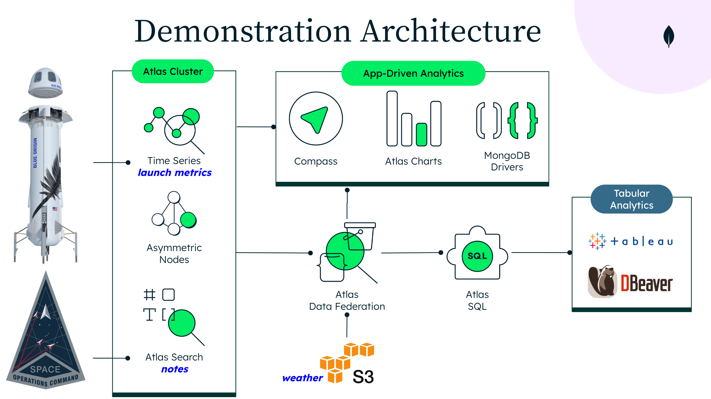

# Boost Engagement with App-Driven Analytics 

Boost customer engagement by providing analytics and visualizations in real-time, based on immediate actions and telemetry, while using a single development data platform.

This demonstration shows how the various components of [MongoDB's
Developer Data Platform (DDP)](https://www.mongodb.com/blog/post/developer-data-platform-highlights-mongodb-world-2022-keynotes) can be used together to support real-time
analytics. It uses an open source data set from a Blue Origin rocket launch
along with fictitional data.

A typical rocket launch spans an eight hour period from the
time the initial countdown begins until the rocket payload is in
orbit. During this eight hour window, approximately 1 million metrics
are generated per second by sensors capturing the rocket
performance. 

While the metrics make up the bulk of the data in this scenario, there
are two other sources of data: notes and weather data. Notes are
created by both rocket engineers and an automated system. The rocket
engineers create notes when they want to mark a time period or
situation that they want to remember to revisit after the launch. 

A fictitional automated system (which can be implemented as [Atlas triggers](https://www.mongodb.com/atlas/database-triggers)) is
continuously watching the metrics as they stream in and creates
notes whenever parameters reach thresholds that are out of
bounds. Weather data is stored in an S3 bucket and analyzed in combination with the launch data post launch.



The demonstration consists of 4 parts (or acts):

### Atlas Cluster and Data
1. Review of the Atlas cluster deployed for the demonstration, and overview of the document model for two main Atlas collections used to store the launch data: `launchData` and `notes`.

### Real-time analytics
2. How MongoDB can be used to perform real-time analytics on the data during launch. 
    * [Compass](https://www.mongodb.com/products/compass) to review a number of aggregation queries on the launch data and notes collections. 
    * [Charts](https://www.mongodb.com/products/charts) dashboard to display visualizations using various charts  

### Search analytics      
3. This section focuses on two areas:
    * [Atlas Search](https://www.mongodb.com/atlas/search) for analytics using facet counts associated with search queries.
	* How various features of the Atlas DDP can be used in combination, via a  react web app (using [MongoDB Drivers](https://www.mongodb.com/docs/drivers/) and 3rd party components like [Reactive Search](https://github.com/appbaseio/reactivesearch)) that supports Atlas search with faceted navigation in combination with embedded Charts. Entering a search phrase, selecting facets, and clicking on search results (notes) updates the time range for the charts shown in the previous step to the time context of the selected note.

### Post-launch analytics	  
4. Using a variety of MongoDB and non-MongoDB data sources to analyze data post launch and using [Atlas Data Federation](https://www.mongodb.com/atlas/data-federation) and [Atlas SQL](https://www.mongodb.com/atlas/sql). Data is pulled from two data sources: Atlas cluster and AWS S3. Atlas Data Federation is used to create a federated endpoint that allows for the combined analysis of the current launch along with the weather data stored in S3. During the demo, this data is analyzed with popular tools such as Compass (for MQL), or [DBeaver](https://dbeaver.io) and [Tableau](https://www.tableau.com) (for SQL).
   

# DEMO SETUP

## Atlas Configuration

The Atlas configuration components consist of:

1. Atlas M30 cluster to store the launch data, and an added M50 analytics node to support demanding analytical queries.
2. Data Federation endpoint combining two data sources:
  * Atlas cluster
  * S3 bucket (contains weather data)
4. Charts Dashboard to review launch data
5. Atlas Triggers to generate notes for out of bound parameters (excluded i this demo for simplicity)
6. Atlas Search indexes to facilitate the note search and obtain facets.
7. Web App built with Reach that leverages Atlas Search & Charts TO-DO [app](https://runkel-rfv-demo-tyypa.mongodbstitch.com), [github](https://github.com/ranfysvalle02/reactivesearch-mdb)
8. [Tableau](https://www.tableau.com/) connected to the Data Federation Endpoint using Tableau connector
9. [DBeaver](https://dbeaver.io/) to execute SQL queries against the Data Federation Endpoint
   (Atlas SQL).
  

## Atlas Cluster data
There are two main collections used in the demo:

* launchData
* notes

This data can be found in the file [aerospace.archive.gz](./data-atlas/aerospace.archive.gz) and restored to an Atlas cluster using [mongorestore](https://www.mongodb.com/docs/database-tools/mongorestore/#mongodb-binary-bin.mongorestore) as  below:

```mongorestore --uri $CONNECTION_STR --username $DBUSER --password $DBUSER_PASS --gzip --archive=./data-atlas/aerospace.archive.gz```

## Atlas Data Federation configuration

The configuration for the data federation endpoint can be found in the [dataFederationConfiguration.json](./data-federation/dataFederationConfiguration.json)  file.

The following schema files were created for Atlas SQL:

- Schema for data in S3 bucket: `~/dataFederation/s3SolarWindSchema.json`

Use [sqlSetSchema](https://www.mongodb.com/docs/atlas/data-federation/query/sql/sqlsetschema/) to update the schemas. Create the data federation endpoint in the Atlas GUI and then connect to data federation using the [mongo shell](https://www.mongodb.com/docs/mongodb-shell/). Execute the following sequence of commands:

```
use ClimateData
db.runCommand({
  sqlSetSchema: "SolarWind",
  schema: {
    "version" : 1,
	"jsonSchema": <contents of s3SolarWindSchema.json>
  }
})
```	

## S3

The S3 bucket contains a single folder called SolarWinds. The contents of this folder are all the `.json` files found in the [data-s3](./data-s3/)] plus the [SolarWindAll_2020_10_13.json](./data-s3/SolarWindAll_2020_10_13.json) file. This file contains all the same documents as the rest of the .json files but the dates are set to match documents in `launchData` (in the Atlas cluster).

Set up the S3 bucket using the following steps:
1. Create an S3 bucket
2. Create a folder called `SolarWinds` in the S3 bucket
3. Upload all the files from [data-s3](./data-s3/) into the `SolarWinds` folder.

The following [AWS CLI](https://aws.amazon.com/cli/) command can be used to upload the files:

```
cd ~/data-s3
aws s3 cp *.json s3://rocket-data-archive/ --recursive
```

## Tableau
Load the [LaunchDayPlasma.twb](./tableau/LaunchDayPlasma.twb) workspace into Tableau

To set up the Tableau connector use the combination of the Federated Endpoint URI plus the database name defined in the Data Federation Endpoint connection configuration. Don't use "myFederatedDatabase".

## Compass

The following aggregation queries should be loaded into Compass

1. Atlas Cluster -> aerospace database -> launchData collection
   * ReadingCountsByDevice
   * rollingWindowCalc
2. Atlas Cluster -> aerospace database -> notes collection
   * searchMetaFacets
   * Data Near Bounds
3. Data Lake -> launchData collection (the one you set the schema on above)
   * ReadingCountByDevice

This queries can be found in the [compass](./compass/) folder.

## Charts Dashboard
The [LaunchData.charts](./charts/LaunchData.charts) dashboard file contains the dashboard with charts that are embedded into the web app. Import this file into your Charts project.


## Reactive-search Web App

Located under the [www](./www/) folder. The executable files are located both in [build](./www/build/) and includes as [hosting files](./appSvcs/reactive-search/hosting/) for reactive-search Atlas App (backend). 

To install:
* Import the Charts Dashboard as mentioned above
* Obtain the embedded dashboard and charts links
* Replace the links in the [Home.tsx](./www/src/Pages/Home.tsx) and [Profile.tsx](./www/src/Pages/Profile.tsx) files.
* run `npm install` and then `npm run build`
* The updated build (with links to your dashboard and charts) can be found in the [build](./www/build/) folder. Upload these files to the `hosting` section of your Atlas App (backend). Review and deploy.


#### Credits for original work

* Data, backend and analytics: https://github.com/jayrunkel/rocketDDPDemo
* Web application: https://github.com/ranfysvalle02/reactivesearch-mdb
